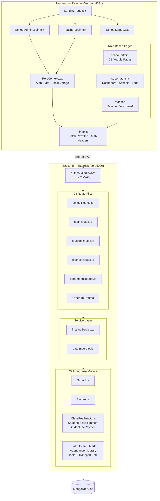
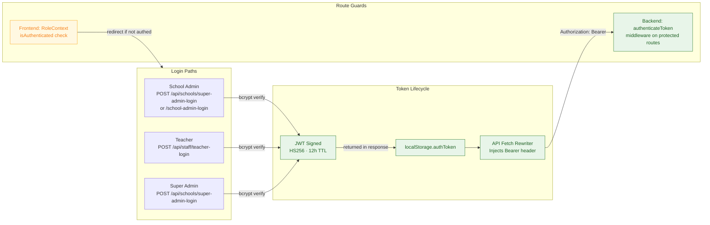
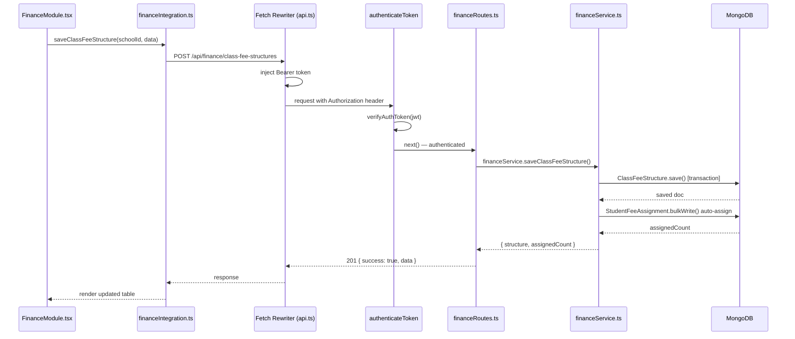
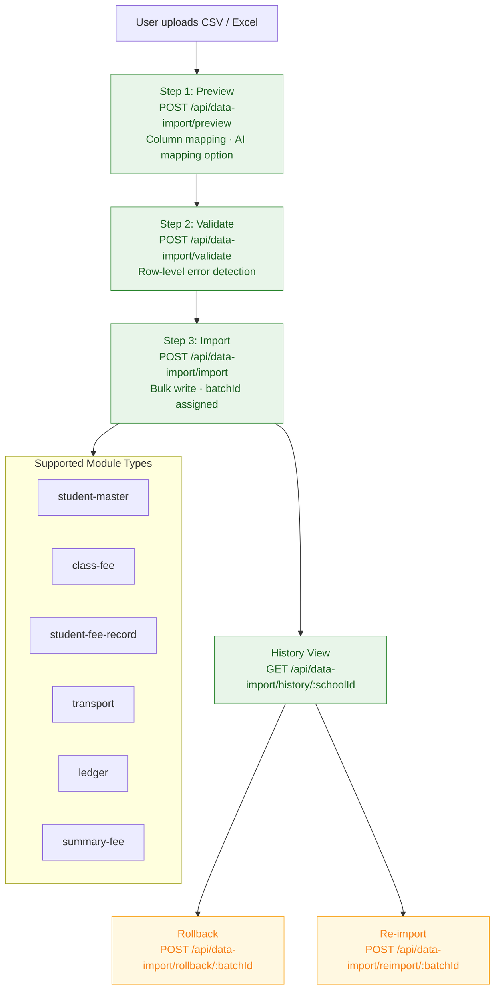

# Code Review Graph — ERP Portal (Full Audit)

> **Audited:** April 5, 2026 | **Stack:** React 18 + Vite / Express + MongoDB / TypeScript

---

## 1. System Architecture Overview



---

## 2. Authentication & Session Flow



---

## 3. Security Finding Map (All Findings)

```mermaid
flowchart TD
    ROOT[Security Audit\nERP Portal]

    ROOT --> P0[P0 · CRITICAL\nFixed in current codebase]
    ROOT --> P1[P1 · HIGH\nFixed in current codebase]
    ROOT --> P2[P2 · MEDIUM\nPartially addressed]
    ROOT --> P3[P3 · LOW\nOpen — needs work]

    P0 --> F1[F1: Plaintext passwords\nNow bcrypt-hashed on save\nLegacy plaintext migrated on login]
    P0 --> F2[F2: Teacher login with name+email only\nNow requires password\nHashed at creation]

    P1 --> F3[F3: No login rate limiting\nNow: in-memory throttle\nper-IP + identifier]
    P1 --> F4[F4: Full DB documents returned on login\nNow: sanitized response\nexcludes password field]

    P2 --> F5[F5: JWT middleware missing on most routes\nFixed: data-import protected\nOpen: 18 other route files]
    P2 --> F6[F6: Client-side auth trust\nRoleContext + localStorage only\nNo server-side session validation]
    P2 --> F7[F7: Dev JWT secret fallback\ndev-only-jwt-secret-change-in-production\nMust be replaced in prod ENV]

    P3 --> F8[F8: 50MB JSON payload limit\nNo streaming or chunked import\nDoS vector on data-import]
    P3 --> F9[F9: @ts-nocheck in finance service\nType safety bypassed\nRuntime ObjectId errors possible]
    P3 --> F10[F10: No RBAC enforcement\nSchool admin can call super-admin routes\nif they hold a valid JWT]
    P3 --> F11[F11: Password shown in signup response\nadminPassword returned in plain JSON\nHTTPS required — not enforced locally]
    P3 --> F12[F12: SMTP credentials in .env\nNo secret rotation mechanism\nNo email provider failover]

    classDef critical fill:#ffebee,stroke:#c62828,stroke-width:2px,color:#b71c1c;
    classDef high fill:#fff3e0,stroke:#ef6c00,stroke-width:2px,color:#e65100;
    classDef medium fill:#e3f2fd,stroke:#1565c0,stroke-width:2px,color:#0d47a1;
    classDef low fill:#f3e5f5,stroke:#6a1b9a,stroke-width:2px,color:#4a148c;
    classDef fixed fill:#e8f5e9,stroke:#2e7d32,stroke-width:2px,color:#1b5e20;

    class P0,F1,F2 fixed;
    class P1,F3,F4 fixed;
    class P2,F5,F6,F7 medium;
    class P3,F8,F9,F10,F11,F12 low;
```



---

## 4. Module Completion Status

```mermaid
flowchart LR
    subgraph BUILD["Build Status per Module"]
        direction TB
        M1[✅ School Signup\nFrontend + Backend + Email]
        M2[✅ Auth System\nJWT · bcrypt · throttle]
        M3[✅ Finance Module\n10 endpoints · service layer · seeds]
        M4[✅ Data Import\nPreview · Validate · Import · Rollback]
        M5[✅ Super Admin Dashboard\nSchools · Logs · Settings · Subscriptions]
        M6[⚠️ Student Module\nCRUD exists · no grade rollup]
        M7[⚠️ Staff / Teacher Module\nLogin works · HR flows incomplete]
        M8[⚠️ Attendance Module\nRoute exists · no reporting UI]
        M9[⚠️ Exams & Marks\nRoutes exist · result sheets missing]
        M10[🔴 Hostel Module\nModel only · no routes wired]
        M11[🔴 Library Module\nModel only · no routes wired]
        M12[🔴 Transport Module\nModel only · routes stub]
        M13[🔴 Inventory Module\nModel only]
        M14[🔴 Visitor Module\nRoute file exists · UI stub]
        M15[🔴 Social Media Module\nUI component exists · no backend]
        M16[🔴 Surveys Module\nUI component exists · no backend]
        M17[🔴 Maintenance Module\nModel exists · no routes]
        M18[🔴 Payment Gateway\nNot started]
        M19[🔴 Notifications / Email Alerts\nSMTP wired · no event triggers]
        M20[🔴 Role-Based Module Access\nPlan tiers defined · not enforced in routes]
    end
```



---

## 5. Data Flow — Finance Module (Detailed)



---

## 6. Data Import Pipeline



---

## 7. MVP Build Phases — Chunk-by-Chunk Roadmap

```mermaid
flowchart TD
    subgraph PH0["Phase 0 — Foundation (DONE ✅)"]
        P0A[Monorepo Setup\nVite + React + Express + MongoDB]
        P0B[Auth: JWT · bcrypt · login throttle]
        P0C[3 Login Portals\nSuper Admin · School Admin · Teacher]
        P0D[School Signup + Email credentials]
        P0E[Subscription Plan Tiers\nBasic 4 · Standard 8 · Premium 14 modules]
        P0F[Super Admin Dashboard\nSchools · Logs · Settings · Subscriptions]
    end

    subgraph PH1["Phase 1 — Core School Operations (Current Sprint)"]
        P1A[Student CRUD\nAdmission · Profile · Roll No · Class]
        P1B[Staff CRUD\nTeacher · HR · Salary Role]
        P1C[Class & Section Management]
        P1D[Attendance Module\nDaily mark · Monthly summary · Reports]
        P1E[Finance: Fee Structure + Collection\nClass fee · Transport · Payments]
        P1F[Data Import\nCSV bulk upload for students + fees]
    end

    subgraph PH2["Phase 2 — Academic Pipeline"]
        P2A[Exam Module\nSchedule · Admit cards]
        P2B[Marks & Results\nEntry · Grade calculation · Report cards]
        P2C[Assignments\nCreate · Submit · Grade]
        P2D[Library\nBook inventory · Issue · Return]
        P2E[Announcements\nBroadcast to roles]
    end

    subgraph PH3["Phase 3 — Operations & Compliance"]
        P3A[Hostel Management\nRooms · Allocation · Fees]
        P3B[Transport Management\nRoutes · Vehicles · Tracking]
        P3C[Leave Management\nApplication · Approval · Balance]
        P3D[Inventory\nItems · Stock · Consumption]
        P3E[Visitor Management\nEntry · Exit · Logs]
        P3F[Maintenance Requests]
    end

    subgraph PH4["Phase 4 — Engagement & Analytics"]
        P4A[Surveys & Feedback]
        P4B[Social Media / Notices]
        P4C[Digital Classroom\nMaterial uploads · Video links]
        P4D[Sports & House Management]
        P4E[Advanced Reports\nAttendance · Finance · Academic analytics]
        P4F[Parent Portal\nFee view · Result view · Attendance]
    end

    subgraph PH5["Phase 5 — Platform Hardening"]
        P5A[RBAC enforcement on all routes\nJWT role check per endpoint]
        P5B[Payment Gateway\nStripe · Razorpay integration]
        P5C[Real-time Notifications\nWebSocket · Push · Email triggers]
        P5D[Multi-tenancy isolation\nSchool data partitioning]
        P5E[Audit Logging\nAll write ops logged with actor]
        P5F[Mobile PWA\nOffline attendance · Push notifications]
    end

    PH0 --> PH1 --> PH2 --> PH3 --> PH4 --> PH5
```



---

## 8. Route Protection Coverage Map

```mermaid
flowchart TD
    SERVER[server.ts\nAll Routes Mounted]

    SERVER --> R1[/api/schools\nschoolRoutes ⚠️ Mixed — some public]
    SERVER --> R2[/api/staff\nstaffRoutes ⚠️ Some unprotected]
    SERVER --> R3[/api/students\nstudentRoutes ⚠️ No global middleware]
    SERVER --> R4[/api/finance\nfinanceRoutes ✅ authenticateToken applied]
    SERVER --> R5[/api/data-import\ndataImportRoutes ✅ authenticateToken applied]
    SERVER --> R6[/api/logs\nlogRoutes ❓ Needs audit]
    SERVER --> R7[/api/attendance\nattendanceRoutes ❓ Needs audit]
    SERVER --> R8[/api/exams\nexamRoutes ❓ Needs audit]
    SERVER --> R9[/api/marks\nmarkRoutes ❓ Needs audit]
    SERVER --> R10[/api/classes\nclassRoutes ❓ Needs audit]
    SERVER --> R11[Other 13 Routes\n⚠️ Auth status unknown]

    classDef safe fill:#e8f5e9,stroke:#2e7d32,color:#1b5e20;
    classDef warn fill:#fff3e0,stroke:#ef6c00,color:#e65100;
    classDef bad fill:#ffebee,stroke:#c62828,color:#b71c1c;
    classDef unknown fill:#f5f5f5,stroke:#757575,color:#424242;

    class R4,R5 safe;
    class R1,R2,R3 warn;
    class R6,R7,R8,R9,R10,R11 unknown;
```

---

## 9. TypeScript / Code Quality Issues

```mermaid
flowchart LR
    subgraph TSISSUES["Type Safety Debt"]
        T1[financeService.ts\n@ts-nocheck — full file bypassed]
        T2[financeRoutes.ts\n@ts-nocheck — full file bypassed]
        T3[financeSeeds.ts\n@ts-nocheck]
        T4[ClassFeeStructure.ts\nclass_id changed String→ObjectId\n schema mismatch debt]
        T5[dataImportRoutes.ts\nGenericRow typed as any]
        T6[Multiple routes\nreq.user cast as unknown]
    end

    subgraph FIXES["Recommended Fixes"]
        FX1[Remove @ts-nocheck\nProper mongoose generic types]
        FX2[Strict AuthRequest type\nextend Express.Request]
        FX3[Zod schema validation\nat every route boundary]
    end

    T1 & T2 & T3 --> FX1
    T6 --> FX2
    T4 & T5 --> FX3
```

---

## 10. Frontend Module Map (25 School Admin Modules)

```mermaid
flowchart TD
    SAP[SchoolModulePage.tsx\nModule Router]

    SAP --> G1[Academic]
    SAP --> G2[Administration]
    SAP --> G3[Finance]
    SAP --> G4[Communication]
    SAP --> G5[Operations]

    G1 --> M1[AcademicsModule ⚠️]
    G1 --> M2[ExamsModule ⚠️]
    G1 --> M3[AttendenceModule ⚠️]
    G1 --> M4[DigitalClassroomModule 🔴]
    G1 --> M5[DownloadsModule 🔴]

    G2 --> M6[StudentModule ✅]
    G2 --> M7[AdmissionsModule ✅]
    G2 --> M8[StaffModule ⚠️]
    G2 --> M9[ClassModule ⚠️]
    G2 --> M10[HRModule 🔴]
    G2 --> M11[ApprovalsModule 🔴]

    G3 --> M12[FinanceModule ✅]
    G3 --> M13[DataImportModule ✅]

    G4 --> M14[CommunicationModule 🔴]
    G4 --> M15[SocialMediaModule 🔴]
    G4 --> M16[SurveyModule 🔴]

    G5 --> M17[HostelModule 🔴]
    G5 --> M18[TransportModule 🔴]
    G5 --> M19[LibraryModule 🔴]
    G5 --> M20[InventoryModule 🔴]
    G5 --> M21[MaintenanceModule 🔴]
    G5 --> M22[VisitorModule 🔴]
    G5 --> M23[SportsModule 🔴]
    G5 --> M24[HouseModule 🔴]
    G5 --> M25[SupportModule 🔴]

    classDef done fill:#e8f5e9,stroke:#2e7d32,color:#1b5e20;
    classDef partial fill:#fff3e0,stroke:#ef6c00,color:#e65100;
    classDef stub fill:#ffebee,stroke:#c62828,color:#b71c1c;

    class M6,M7,M12,M13 done;
    class M1,M2,M3,M8,M9 partial;
    class M4,M5,M10,M11,M14,M15,M16,M17,M18,M19,M20,M21,M22,M23,M24,M25 stub;
```



---

## 11. Immediate Action Priority Queue

| Priority | Finding | File(s) | Action |
|----------|---------|---------|--------|
| 🔴 P0 | JWT middleware missing on 18+ routes | `backend/src/server.ts` | Apply `authenticateToken` globally before route mounting |
| 🔴 P0 | No RBAC role check per route | All route files | Add role guard: `req.user.role === 'school-admin'` |
| 🟠 P1 | `@ts-nocheck` in finance service | `financeService.ts`, `financeRoutes.ts` | Replace with proper Mongoose generic types |
| 🟠 P1 | Dev JWT secret used if ENV missing | `backend/src/utils/jwt.ts` | Throw on missing `JWT_SECRET` in non-dev mode |
| 🟠 P1 | `adminPassword` returned in plain JSON | `schoolRoutes.ts` register endpoint | Only return over HTTPS; add `Strict-Transport-Security` header |
| 🟡 P2 | 50MB JSON body limit — DoS risk | `backend/src/server.ts` | Use streaming multipart upload for data import |
| 🟡 P2 | localStorage auth — XSS vulnerable | `src/lib/auth.ts` | Plan migration to `httpOnly` cookie sessions |
| 🟡 P2 | No audit trail on write ops | All mutation routes | Integrate `Logs` model on every POST/PUT/DELETE |
| 🟢 P3 | No email event triggers | `backend/src/utils/sendEmail.ts` | Wire attendance/fee-due/result notifications |
| 🟢 P3 | 25 modules — 17 are UI stubs | `src/pages/school-admin/modules/` | Phase 2–3 build out per roadmap above |

---

## Severity Guide

| Symbol | Meaning |
|--------|---------|
| ✅ | Built, tested, and working |
| ⚠️ | Partially built — backend or frontend incomplete |
| 🔴 | Stub only — UI component exists with no real backend wiring |
| 🔴 P0 | Critical security issue — fix before any production traffic |
| 🟠 P1 | High — fix before any real user data is stored |
| 🟡 P2 | Medium — schedule for next sprint |
| 🟢 P3 | Low / enhancement — Phase 3+ work |
