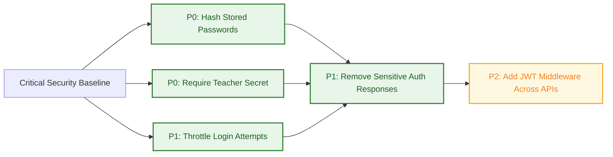

# Security Fix Priority Graph

## Implemented In This Pass

- P0: Hash stored school admin passwords and migrate legacy plaintext on successful login.
- P0: Require teacher email plus password login, hash teacher password at creation, and migrate legacy plaintext if found.
- P1: Add login throttling for school and teacher login endpoints (in-memory, per IP plus identifier).
- P1: Sanitize auth responses to exclude password and excessive data.

## Next Suggested Fix

- P2: Introduce JWT-based authentication middleware and apply to all non-public backend routes.
