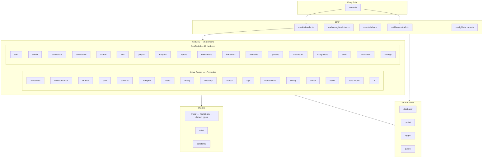

# ERP Portal — Modular Monolith Architecture

## Layer Overview



## Module Internal Structure

Every module follows this layout:

```
modules/{name}/
├── index.ts              ← Route manifest (public API of module)
├── api/                  ← HTTP handlers / controllers
├── application/          ← Use cases / service layer
├── domain/               ← Entities, value objects, domain logic
├── infrastructure/       ← Persistence adapters (repositories)
├── events/               ← Domain event definitions + handlers
├── jobs/                 ← Background tasks / cron jobs
└── tests/                ← Module-scoped tests
```

## Route Registration Flow

```
server.ts
  └── core/moduleLoader.ts  (35 module index.ts imports → flat RouteEntry[])
        ├── modules/academics/index.ts  → [/api/assignments, /api/attendance, ...]
        ├── modules/finance/index.ts    → [/api/finance, /api/expenses, ...]
        ├── modules/school/index.ts     → [/api/schools (skipAuth), /api/dashboard]
        ├── modules/staff/index.ts      → [..., /api/staff (skipAuth), ...]
        └── ... 31 more modules
```

## skipAuth Routes (public endpoints)

| Route | Module |
|-------|--------|
| `/api/schools` | school |
| `/api/staff` | staff |
