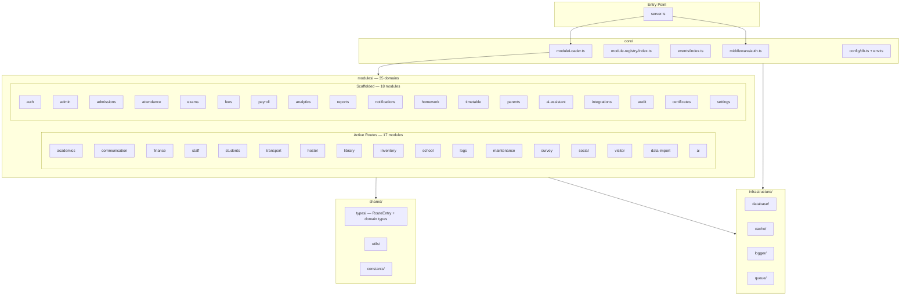

# Modular Monolith Refactor Implementation Plan

> **For agentic workers:** REQUIRED SUB-SKILL: Use superpowers:subagent-driven-development (recommended) or superpowers:executing-plans to implement this plan task-by-task. Steps use checkbox (`- [ ]`) syntax for tracking.

**Goal:** Standardize all 35 backend modules to a uniform DDD folder structure, expose each module's routes via a root `index.ts` manifest, and eliminate all 30 inline route imports from `server.ts` through a central module loader.

**Architecture:** A `RouteEntry` type added to `shared/types/`; each module's root `index.ts` exports `routes: RouteEntry[]`; `core/moduleLoader.ts` aggregates all 35 manifests into a flat array consumed by one `forEach` loop in `server.ts`. Simple modules (ai, data-import, logs, maintenance, school, social, survey, visitor) get missing DDD subdirectories scaffolded as `export {};` placeholders. No business logic moves — all route handler files stay in place.

**Tech Stack:** TypeScript 5, Express 5, Node16 module resolution. Path aliases `@modules/*`, `@core/*`, `@shared/*`, `@infrastructure/*` already configured in `backend/tsconfig.json`. Auth middleware is `authenticateToken` from `./core/middleware/auth`.

---

## Current State

- **server.ts lines 6–35:** 30 inline `import` statements from module route files
- **server.ts lines 105–134:** 30 inline `app.use(...)` registrations
- **core/events/**, **core/module-registry/**, **infrastructure/** — already exist (untracked)
- **8 simple modules** (ai, data-import, logs, maintenance, school, social, survey, visitor) — only have `models/` + `routes/` at root; missing DDD subdirs
- **9 extended modules** (academics, communication, finance, hostel, inventory, library, staff, students, transport) — have full DDD dirs + legacy `models/` + `routes/`; active routes in `routes/`
- **18 DDD-only modules** (admin, admissions, ai-assistant, analytics, attendance, audit, auth, certificates, exams, fees, homework, integrations, notifications, parents, payroll, reports, settings, timetable) — full DDD dirs but no active routes in `server.ts`

---

### Task 1: Add RouteEntry type to shared/types

**Files:**
- Modify: `backend/src/shared/types/index.ts`

- [ ] **Step 1: Append RouteEntry to shared types**

Current file ends at line 23. Append after the last export:

```typescript
import type { Router } from 'express';

export interface RouteEntry {
  path: string;
  router: Router;
  skipAuth?: boolean;
}
```

- [ ] **Step 2: Compile check**

Run from `backend/`: `npx tsc --noEmit 2>&1 | head -30`

Expected: 0 new errors. If `Router` import conflicts with existing imports, add it to the existing `import ... from 'express'` line at the top instead of adding a new import.

- [ ] **Step 3: Commit**

```bash
git add backend/src/shared/types/index.ts
git commit -m "feat(shared): add RouteEntry type for module route manifests"
```

---

### Task 2: Scaffold DDD subfolders for 8 simple modules

**Files:**
- Create: `backend/src/modules/{ai,data-import,logs,maintenance,school,social,survey,visitor}/{api,application,domain,events,infrastructure,jobs}/index.ts` (48 files, all identical: `export {};`)
- Create: `backend/src/modules/{ai,data-import,logs,maintenance,school,social,survey,visitor}/tests/.gitkeep` (8 files)

- [ ] **Step 1: Create all subdirs and placeholder files (PowerShell)**

Run from project root (`c:\Users\JAY\OneDrive\Desktop\erp\erp_portal`):

```powershell
$modules = @('ai','data-import','logs','maintenance','school','social','survey','visitor')
$subfolders = @('api','application','domain','events','infrastructure','jobs')
foreach ($mod in $modules) {
  foreach ($sub in $subfolders) {
    $path = "backend/src/modules/$mod/$sub"
    New-Item -ItemType Directory -Force -Path $path | Out-Null
    $file = "$path/index.ts"
    if (-not (Test-Path $file)) {
      Set-Content -Path $file -Value "export {};" -Encoding utf8
    }
  }
  $testsPath = "backend/src/modules/$mod/tests"
  New-Item -ItemType Directory -Force -Path $testsPath | Out-Null
  $gitkeep = "$testsPath/.gitkeep"
  if (-not (Test-Path $gitkeep)) {
    New-Item -ItemType File -Path $gitkeep | Out-Null
  }
}
Write-Host "Done."
```

Expected output: `Done.`

- [ ] **Step 2: Spot-check one module**

Run: `Get-ChildItem backend/src/modules/school -Name`

Expected: api, application, domain, events, infrastructure, jobs, models, routes, tests all present.

- [ ] **Step 3: Commit**

```bash
git add backend/src/modules/ai backend/src/modules/data-import backend/src/modules/logs backend/src/modules/maintenance backend/src/modules/school backend/src/modules/social backend/src/modules/survey backend/src/modules/visitor
git commit -m "feat: scaffold DDD subdirectory structure for 8 simple modules"
```

---

### Task 3: Add root index.ts to 8 simple modules

**Files:**
- Create: `backend/src/modules/ai/index.ts`
- Create: `backend/src/modules/data-import/index.ts`
- Create: `backend/src/modules/logs/index.ts`
- Create: `backend/src/modules/maintenance/index.ts`
- Create: `backend/src/modules/school/index.ts`
- Create: `backend/src/modules/social/index.ts`
- Create: `backend/src/modules/survey/index.ts`
- Create: `backend/src/modules/visitor/index.ts`

- [ ] **Step 1: Create backend/src/modules/ai/index.ts**

```typescript
import type { RouteEntry } from '../../shared/types';
import aiRoutes from './routes/aiRoutes';

const routes: RouteEntry[] = [
  { path: '/api/ai', router: aiRoutes },
];

export default routes;
```

- [ ] **Step 2: Create backend/src/modules/data-import/index.ts**

```typescript
import type { RouteEntry } from '../../shared/types';
import dataImportRoutes from './routes/dataImportRoutes';

const routes: RouteEntry[] = [
  { path: '/api/data-import', router: dataImportRoutes },
];

export default routes;
```

- [ ] **Step 3: Create backend/src/modules/logs/index.ts**

```typescript
import type { RouteEntry } from '../../shared/types';
import logRoutes from './routes/logRoutes';

const routes: RouteEntry[] = [
  { path: '/api/logs', router: logRoutes },
];

export default routes;
```

- [ ] **Step 4: Create backend/src/modules/maintenance/index.ts**

```typescript
import type { RouteEntry } from '../../shared/types';
import maintenanceRoutes from './routes/maintenanceRoutes';

const routes: RouteEntry[] = [
  { path: '/api/maintenance', router: maintenanceRoutes },
];

export default routes;
```

- [ ] **Step 5: Create backend/src/modules/school/index.ts**

```typescript
import type { RouteEntry } from '../../shared/types';
import schoolRoutes from './routes/schoolRoutes';
import dashboardRoutes from './routes/dashboardRoutes';

const routes: RouteEntry[] = [
  { path: '/api/schools', router: schoolRoutes, skipAuth: true },
  { path: '/api/dashboard', router: dashboardRoutes },
];

export default routes;
```

- [ ] **Step 6: Create backend/src/modules/social/index.ts**

```typescript
import type { RouteEntry } from '../../shared/types';
import socialMediaRoutes from './routes/socialMediaRoutes';

const routes: RouteEntry[] = [
  { path: '/api/social-media', router: socialMediaRoutes },
];

export default routes;
```

- [ ] **Step 7: Create backend/src/modules/survey/index.ts**

```typescript
import type { RouteEntry } from '../../shared/types';
import surveyRoutes from './routes/surveyRoutes';

const routes: RouteEntry[] = [
  { path: '/api/surveys', router: surveyRoutes },
];

export default routes;
```

- [ ] **Step 8: Create backend/src/modules/visitor/index.ts**

```typescript
import type { RouteEntry } from '../../shared/types';
import visitorRoutes from './routes/visitorRoutes';

const routes: RouteEntry[] = [
  { path: '/api/visitors', router: visitorRoutes },
];

export default routes;
```

- [ ] **Step 9: Compile check**

Run from `backend/`: `npx tsc --noEmit 2>&1 | head -30`

Expected: 0 new errors.

- [ ] **Step 10: Commit**

```bash
git add backend/src/modules/ai/index.ts backend/src/modules/data-import/index.ts backend/src/modules/logs/index.ts backend/src/modules/maintenance/index.ts backend/src/modules/school/index.ts backend/src/modules/social/index.ts backend/src/modules/survey/index.ts backend/src/modules/visitor/index.ts
git commit -m "feat: add route manifest index.ts to 8 simple modules"
```

---

### Task 4: Add root index.ts to 9 extended modules

Extended modules already have DDD subdirs AND legacy `routes/` folder. Active routes are in `routes/` — import from there.

**Files:**
- Create: `backend/src/modules/academics/index.ts`
- Create: `backend/src/modules/communication/index.ts`
- Create: `backend/src/modules/finance/index.ts`
- Create: `backend/src/modules/hostel/index.ts`
- Create: `backend/src/modules/inventory/index.ts`
- Create: `backend/src/modules/library/index.ts`
- Create: `backend/src/modules/staff/index.ts`
- Create: `backend/src/modules/students/index.ts`
- Create: `backend/src/modules/transport/index.ts`

- [ ] **Step 1: Create backend/src/modules/academics/index.ts**

Note: academics owns attendance and exams routes (tight coupling — see dependency report Task 9).

```typescript
import type { RouteEntry } from '../../shared/types';
import assignmentRoutes from './routes/assignmentRoutes';
import attendanceRoutes from './routes/attendanceRoutes';
import classRoutes from './routes/classRoutes';
import examRoutes from './routes/examRoutes';
import markRoutes from './routes/markRoutes';
import materialRoutes from './routes/materialRoutes';
import subjectRoutes from './routes/subjectRoutes';

const routes: RouteEntry[] = [
  { path: '/api/assignments', router: assignmentRoutes },
  { path: '/api/attendance', router: attendanceRoutes },
  { path: '/api/classes', router: classRoutes },
  { path: '/api/exams', router: examRoutes },
  { path: '/api/marks', router: markRoutes },
  { path: '/api/materials', router: materialRoutes },
  { path: '/api/subjects', router: subjectRoutes },
];

export default routes;
```

- [ ] **Step 2: Create backend/src/modules/communication/index.ts**

```typescript
import type { RouteEntry } from '../../shared/types';
import announcementRoutes from './routes/announcementRoutes';
import communicationRoutes from './routes/communicationRoutes';

const routes: RouteEntry[] = [
  { path: '/api/announcements', router: announcementRoutes },
  { path: '/api/communication', router: communicationRoutes },
];

export default routes;
```

- [ ] **Step 3: Create backend/src/modules/finance/index.ts**

Note: salary-structures belongs in payroll domain — see dependency report Task 9.

```typescript
import type { RouteEntry } from '../../shared/types';
import bankingRoutes from './routes/bankingRoutes';
import expenseRoutes from './routes/expenseRoutes';
import financeRoutes from './routes/financeRoutes';
import salaryStructureRoutes from './routes/salaryStructureRoutes';

const routes: RouteEntry[] = [
  { path: '/api/banking', router: bankingRoutes },
  { path: '/api/expenses', router: expenseRoutes },
  { path: '/api/finance', router: financeRoutes },
  { path: '/api/salary-structures', router: salaryStructureRoutes },
];

export default routes;
```

- [ ] **Step 4: Create backend/src/modules/hostel/index.ts**

```typescript
import type { RouteEntry } from '../../shared/types';
import hostelRoutes from './routes/hostelRoutes';

const routes: RouteEntry[] = [
  { path: '/api/hostels', router: hostelRoutes },
];

export default routes;
```

- [ ] **Step 5: Create backend/src/modules/inventory/index.ts**

```typescript
import type { RouteEntry } from '../../shared/types';
import inventoryRoutes from './routes/inventoryRoutes';

const routes: RouteEntry[] = [
  { path: '/api/inventory', router: inventoryRoutes },
];

export default routes;
```

- [ ] **Step 6: Create backend/src/modules/library/index.ts**

```typescript
import type { RouteEntry } from '../../shared/types';
import libraryRoutes from './routes/libraryRoutes';

const routes: RouteEntry[] = [
  { path: '/api/library', router: libraryRoutes },
];

export default routes;
```

- [ ] **Step 7: Create backend/src/modules/staff/index.ts**

```typescript
import type { RouteEntry } from '../../shared/types';
import leaveRoutes from './routes/leaveRoutes';
import staffRoutes from './routes/staffRoutes';
import teacherRoleRoutes from './routes/teacherRoleRoutes';

const routes: RouteEntry[] = [
  { path: '/api/leaves', router: leaveRoutes },
  { path: '/api/staff', router: staffRoutes, skipAuth: true },
  { path: '/api/teacher-roles', router: teacherRoleRoutes },
];

export default routes;
```

- [ ] **Step 8: Create backend/src/modules/students/index.ts**

```typescript
import type { RouteEntry } from '../../shared/types';
import studentRoutes from './routes/studentRoutes';

const routes: RouteEntry[] = [
  { path: '/api/students', router: studentRoutes },
];

export default routes;
```

- [ ] **Step 9: Create backend/src/modules/transport/index.ts**

```typescript
import type { RouteEntry } from '../../shared/types';
import transportRoutes from './routes/transportRoutes';

const routes: RouteEntry[] = [
  { path: '/api/transport', router: transportRoutes },
];

export default routes;
```

- [ ] **Step 10: Compile check**

Run from `backend/`: `npx tsc --noEmit 2>&1 | head -30`

Expected: 0 new errors.

- [ ] **Step 11: Commit**

```bash
git add backend/src/modules/academics/index.ts backend/src/modules/communication/index.ts backend/src/modules/finance/index.ts backend/src/modules/hostel/index.ts backend/src/modules/inventory/index.ts backend/src/modules/library/index.ts backend/src/modules/staff/index.ts backend/src/modules/students/index.ts backend/src/modules/transport/index.ts
git commit -m "feat: add route manifest index.ts to 9 extended modules"
```

---

### Task 5: Add root index.ts to 18 DDD-only modules

These modules have full DDD folder structure but no active routes in `server.ts`. They export an empty array as a placeholder until their `api/` routes are implemented.

**Files:**
- Create: `backend/src/modules/{admin,admissions,ai-assistant,analytics,attendance,audit,auth,certificates,exams,fees,homework,integrations,notifications,parents,payroll,reports,settings,timetable}/index.ts`

- [ ] **Step 1: Create all 18 placeholder index.ts files (PowerShell)**

Run from project root:

```powershell
$modules = @('admin','admissions','ai-assistant','analytics','attendance','audit','auth','certificates','exams','fees','homework','integrations','notifications','parents','payroll','reports','settings','timetable')
foreach ($mod in $modules) {
  $file = "backend/src/modules/$mod/index.ts"
  if (-not (Test-Path $file)) {
    $content = "import type { RouteEntry } from '../../shared/types';`n`n// Routes not yet active — implement in api/ then register here`nconst routes: RouteEntry[] = [];`n`nexport default routes;`n"
    Set-Content -Path $file -Value $content -Encoding utf8
    Write-Host "Created $file"
  }
}
Write-Host "Done."
```

Expected: 18 "Created..." lines then "Done."

- [ ] **Step 2: Compile check**

Run from `backend/`: `npx tsc --noEmit 2>&1 | head -30`

Expected: 0 new errors.

- [ ] **Step 3: Commit**

```bash
git add backend/src/modules/admin/index.ts backend/src/modules/admissions/index.ts backend/src/modules/ai-assistant/index.ts backend/src/modules/analytics/index.ts backend/src/modules/attendance/index.ts backend/src/modules/audit/index.ts backend/src/modules/auth/index.ts backend/src/modules/certificates/index.ts backend/src/modules/exams/index.ts backend/src/modules/fees/index.ts backend/src/modules/homework/index.ts backend/src/modules/integrations/index.ts backend/src/modules/notifications/index.ts backend/src/modules/parents/index.ts backend/src/modules/payroll/index.ts backend/src/modules/reports/index.ts backend/src/modules/settings/index.ts backend/src/modules/timetable/index.ts
git commit -m "feat: add empty route manifest index.ts to 18 DDD-only modules"
```

---

### Task 6: Create core/moduleLoader.ts

**Files:**
- Create: `backend/src/core/moduleLoader.ts`

- [ ] **Step 1: Create the module loader**

```typescript
import type { RouteEntry } from '../shared/types';

import academicsRoutes from '../modules/academics';
import adminRoutes from '../modules/admin';
import admissionsRoutes from '../modules/admissions';
import aiRoutes from '../modules/ai';
import aiAssistantRoutes from '../modules/ai-assistant';
import analyticsRoutes from '../modules/analytics';
import attendanceRoutes from '../modules/attendance';
import auditRoutes from '../modules/audit';
import authRoutes from '../modules/auth';
import certificatesRoutes from '../modules/certificates';
import communicationRoutes from '../modules/communication';
import dataImportRoutes from '../modules/data-import';
import examsRoutes from '../modules/exams';
import feesRoutes from '../modules/fees';
import financeRoutes from '../modules/finance';
import homeworkRoutes from '../modules/homework';
import hostelRoutes from '../modules/hostel';
import integrationsRoutes from '../modules/integrations';
import inventoryRoutes from '../modules/inventory';
import libraryRoutes from '../modules/library';
import logsRoutes from '../modules/logs';
import maintenanceRoutes from '../modules/maintenance';
import notificationsRoutes from '../modules/notifications';
import parentsRoutes from '../modules/parents';
import payrollRoutes from '../modules/payroll';
import reportsRoutes from '../modules/reports';
import schoolRoutes from '../modules/school';
import settingsRoutes from '../modules/settings';
import socialRoutes from '../modules/social';
import staffRoutes from '../modules/staff';
import studentsRoutes from '../modules/students';
import surveyRoutes from '../modules/survey';
import timetableRoutes from '../modules/timetable';
import transportRoutes from '../modules/transport';
import visitorRoutes from '../modules/visitor';

export const moduleRoutes: RouteEntry[] = [
  ...academicsRoutes,
  ...adminRoutes,
  ...admissionsRoutes,
  ...aiRoutes,
  ...aiAssistantRoutes,
  ...analyticsRoutes,
  ...attendanceRoutes,
  ...auditRoutes,
  ...authRoutes,
  ...certificatesRoutes,
  ...communicationRoutes,
  ...dataImportRoutes,
  ...examsRoutes,
  ...feesRoutes,
  ...financeRoutes,
  ...homeworkRoutes,
  ...hostelRoutes,
  ...integrationsRoutes,
  ...inventoryRoutes,
  ...libraryRoutes,
  ...logsRoutes,
  ...maintenanceRoutes,
  ...notificationsRoutes,
  ...parentsRoutes,
  ...payrollRoutes,
  ...reportsRoutes,
  ...schoolRoutes,
  ...settingsRoutes,
  ...socialRoutes,
  ...staffRoutes,
  ...studentsRoutes,
  ...surveyRoutes,
  ...timetableRoutes,
  ...transportRoutes,
  ...visitorRoutes,
];
```

- [ ] **Step 2: Compile check**

Run from `backend/`: `npx tsc --noEmit 2>&1 | head -30`

Expected: 0 new errors.

- [ ] **Step 3: Commit**

```bash
git add backend/src/core/moduleLoader.ts
git commit -m "feat(core): add moduleLoader aggregating all 35 module route manifests"
```

---

### Task 7: Update server.ts to use module loader

**Files:**
- Modify: `backend/src/server.ts`

- [ ] **Step 1: Replace the 30 route import lines (lines 6–35)**

Remove these lines from `server.ts`:

```typescript
import schoolRoutes from "./modules/school/routes/schoolRoutes";
import logRoutes from "./modules/logs/routes/logRoutes";
import dashboardRoutes from "./modules/school/routes/dashboardRoutes";
import announcementRoutes from "./modules/communication/routes/announcementRoutes";
import communicationRoutes from "./modules/communication/routes/communicationRoutes";
import attendanceRoutes from "./modules/academics/routes/attendanceRoutes";
import assignmentRoutes from "./modules/academics/routes/assignmentRoutes";
import examRoutes from "./modules/academics/routes/examRoutes";
import markRoutes from "./modules/academics/routes/markRoutes";
import leaveRoutes from "./modules/staff/routes/leaveRoutes";
import maintenanceRoutes from "./modules/maintenance/routes/maintenanceRoutes";
import surveyRoutes from "./modules/survey/routes/surveyRoutes";
import studentRoutes from "./modules/students/routes/studentRoutes";
import staffRoutes from "./modules/staff/routes/staffRoutes";
import classRoutes from "./modules/academics/routes/classRoutes";
import financeRoutes from "./modules/finance/routes/financeRoutes";
import transportRoutes from "./modules/transport/routes/transportRoutes";
import hostelRoutes from "./modules/hostel/routes/hostelRoutes";
import libraryRoutes from "./modules/library/routes/libraryRoutes";
import inventoryRoutes from "./modules/inventory/routes/inventoryRoutes";
import teacherRoleRoutes from "./modules/staff/routes/teacherRoleRoutes";
import socialMediaRoutes from "./modules/social/routes/socialMediaRoutes";
import visitorRoutes from "./modules/visitor/routes/visitorRoutes";
import dataImportRoutes from "./modules/data-import/routes/dataImportRoutes";
import salaryStructureRoutes from "./modules/finance/routes/salaryStructureRoutes";
import expenseRoutes from "./modules/finance/routes/expenseRoutes";
import bankingRoutes from "./modules/finance/routes/bankingRoutes";
import subjectRoutes from "./modules/academics/routes/subjectRoutes";
import materialRoutes from "./modules/academics/routes/materialRoutes";
import aiRoutes from "./modules/ai/routes/aiRoutes";
```

Replace with this single import:

```typescript
import { moduleRoutes } from "./core/moduleLoader";
```

- [ ] **Step 2: Replace the 30 app.use route registrations (lines 105–134)**

Remove these lines from `server.ts`:

```typescript
app.use("/api/schools", schoolRoutes);
app.use("/api/logs", authenticateToken, logRoutes);
app.use("/api/dashboard", authenticateToken, dashboardRoutes);
app.use("/api/announcements", authenticateToken, announcementRoutes);
app.use("/api/communication", authenticateToken, communicationRoutes);
app.use("/api/attendance", authenticateToken, attendanceRoutes);
app.use("/api/assignments", authenticateToken, assignmentRoutes);
app.use("/api/exams", authenticateToken, examRoutes);
app.use("/api/marks", authenticateToken, markRoutes);
app.use("/api/leaves", authenticateToken, leaveRoutes);
app.use("/api/maintenance", authenticateToken, maintenanceRoutes);
app.use("/api/surveys", authenticateToken, surveyRoutes);
app.use("/api/students", authenticateToken, studentRoutes);
app.use("/api/staff", staffRoutes);
app.use("/api/classes", authenticateToken, classRoutes);
app.use("/api/finance", authenticateToken, financeRoutes);
app.use("/api/transport", authenticateToken, transportRoutes);
app.use("/api/hostels", authenticateToken, hostelRoutes);
app.use("/api/library", authenticateToken, libraryRoutes);
app.use("/api/inventory", authenticateToken, inventoryRoutes);
app.use("/api/teacher-roles", authenticateToken, teacherRoleRoutes);
app.use("/api/social-media", authenticateToken, socialMediaRoutes);
app.use("/api/visitors", authenticateToken, visitorRoutes);
app.use("/api/data-import", authenticateToken, dataImportRoutes);
app.use("/api/salary-structures", authenticateToken, salaryStructureRoutes);
app.use("/api/expenses", authenticateToken, expenseRoutes);
app.use("/api/banking", authenticateToken, bankingRoutes);
app.use("/api/subjects", authenticateToken, subjectRoutes);
app.use("/api/materials", authenticateToken, materialRoutes);
app.use("/api/ai", authenticateToken, aiRoutes);
```

Replace with:

```typescript
moduleRoutes.forEach(({ path, router, skipAuth }) => {
  if (skipAuth) {
    app.use(path, router);
  } else {
    app.use(path, authenticateToken, router);
  }
});
```

- [ ] **Step 3: Compile check**

Run from `backend/`: `npx tsc --noEmit 2>&1 | head -50`

Expected: 0 errors.

If errors appear about missing module imports, verify that all 35 module `index.ts` files were created in Tasks 3–5.

- [ ] **Step 4: Build and start server**

```bash
cd backend
npx tsc
node dist/server.js &
```

Expected: `Server running on port 5000`

- [ ] **Step 5: Verify health endpoint**

```bash
curl http://localhost:5000/api/health
```

Expected: `{"ok":true,...}` JSON response.

- [ ] **Step 6: Verify a no-auth route**

```bash
curl http://localhost:5000/api/schools
```

Expected: JSON response (not 401 or connection refused).

- [ ] **Step 7: Kill test server and commit**

```bash
# Windows: stop the background node process
taskkill /F /IM node.exe
```

```bash
git add backend/src/server.ts
git commit -m "refactor(server): replace 30 inline route imports with moduleLoader forEach"
```

---

### Task 8: Architecture diagram

**Files:**
- Create: `docs/architecture/modular-monolith.md`

- [ ] **Step 1: Create architecture diagram**

Create `docs/architecture/modular-monolith.md`:

```markdown
# ERP Portal — Modular Monolith Architecture

## Layer Overview



## Module Internal Structure

Every module follows this layout:

```
modules/{name}/
├── index.ts              ← Route manifest (public API of module)
├── api/                  ← HTTP handlers / controllers
├── application/          ← Use cases / service layer
├── domain/               ← Entities, value objects, domain logic
├── infrastructure/       ← Persistence adapters (repositories)
├── events/               ← Domain event definitions + handlers
├── jobs/                 ← Background tasks / cron jobs
└── tests/                ← Module-scoped tests
```

## Route Registration Flow

```
server.ts
  └── core/moduleLoader.ts  (35 module index.ts imports → flat RouteEntry[])
        ├── modules/academics/index.ts  → [/api/assignments, /api/attendance, ...]
        ├── modules/finance/index.ts    → [/api/finance, /api/expenses, ...]
        ├── modules/school/index.ts     → [/api/schools (skipAuth), /api/dashboard]
        ├── modules/staff/index.ts      → [..., /api/staff (skipAuth), ...]
        └── ... 31 more modules
```

## skipAuth Routes (public endpoints)

| Route | Module |
|-------|--------|
| `/api/schools` | school |
| `/api/staff` | staff |
```

- [ ] **Step 2: Commit**

```bash
git add docs/architecture/modular-monolith.md
git commit -m "docs: add modular monolith architecture diagram"
```

---

### Task 9: Dependency report and tight coupling analysis

**Files:**
- Create: `docs/architecture/dependency-report.md`

- [ ] **Step 1: Create dependency report**

Create `docs/architecture/dependency-report.md`:

```markdown
# Module Dependency Report

Generated: 2026-05-23

## Cross-Module Route Ownership (Tight Couplings)

### 🔴 HIGH — Routes owned by wrong module

| Route file | Currently in | Should be in | Impact |
|-----------|-------------|--------------|--------|
| `attendanceRoutes.ts` | `academics/routes/` | `attendance/api/` | Cannot extract `attendance` module independently — it has no active routes despite having full DDD structure |
| `examRoutes.ts` | `academics/routes/` | `exams/api/` | Same — `exams` module is a hollow scaffold |
| `markRoutes.ts` | `academics/routes/` | `exams/api/` or new `marks` module | `marks` has no dedicated module at all |
| `salaryStructureRoutes.ts` | `finance/routes/` | `payroll/api/` | Payroll domain is split: module exists in `payroll/` but salary routes live in `finance/` |

**Resolution path for each:**
1. Move route file to the correct module's `api/` folder
2. Update the originating module's `index.ts` to remove the entry
3. Add entry to the target module's `index.ts`
4. No other files change (business logic stays in route files)

---

### 🟡 MEDIUM — Multi-domain modules

| Module | Domains mixed | Recommended split |
|--------|--------------|-------------------|
| `academics` | classes, subjects, materials, assignments, attendance, exams, marks | Separate attendance + exams per HIGH couplings above |
| `finance` | fee collection, expenses, banking, salary structures | Move salary → payroll; consider banking as separate module |
| `staff` | staff profiles, leave management, teacher roles | Leave management could become `hr` module |
| `communication` | announcements + general communication | Fine at current scale; separate if volume grows |

---

### 🟢 LOW — Shared infrastructure

| Issue | Location | Notes |
|-------|----------|-------|
| Email utility | `core/utils/sendEmail.ts` | Should move to `infrastructure/email/` for extraction readiness |
| JWT utility | `core/utils/jwt.ts` | Already in `core/` — fine |
| Auth middleware | `core/middleware/auth.ts` | Already in `core/` — fine |
| Login throttle | `core/utils/loginThrottle.ts` | Move to `infrastructure/cache/` when Redis is introduced |

---

## Module Infrastructure Usage

| Module | MongoDB | Cache | Queue | Email |
|--------|---------|-------|-------|-------|
| academics | ✓ | — | — | — |
| communication | ✓ | — | — | ✓ |
| finance | ✓ | — | — | — |
| students | ✓ | — | — | — |
| staff | ✓ | — | — | — |
| transport | ✓ | — | — | — |
| hostel | ✓ | — | — | — |
| library | ✓ | — | — | — |
| inventory | ✓ | — | — | — |
| school | ✓ | — | — | ✓ |

---

## Recommended Service Extraction Order

When ready to split into microservices, extract in this order (least coupled → most coupled):

1. `analytics` — read-only aggregations, no writes other modules depend on
2. `reports` — read-only
3. `notifications` — event-driven, already has `events/` folder
4. `ai-assistant` — independent capability
5. `library`, `inventory`, `hostel` — low cross-module coupling
6. `finance` — after moving salary routes to `payroll`
7. `auth` — after moving login routes from `school`/`staff` to `auth/api/`
8. `attendance`, `exams` — after migrating routes out of `academics`
9. `students`, `staff` — high mutual coupling, extract together
10. `academics` — last; depends on all above being extracted first
```

- [ ] **Step 2: Commit**

```bash
git add docs/architecture/dependency-report.md
git commit -m "docs: add module dependency report and tight coupling analysis"
```

---

## Post-Implementation Verification Checklist

- [ ] `cd backend && npx tsc --noEmit` — 0 errors
- [ ] `cd backend && node dist/server.js` — prints `Server running on port 5000`
- [ ] `curl http://localhost:5000/api/health` — returns `{"ok":true,...}`
- [ ] `curl http://localhost:5000/api/schools` — returns data (skipAuth route)
- [ ] All 35 modules have `index.ts` at their root
- [ ] All 8 simple modules have `api/`, `application/`, `domain/`, `events/`, `infrastructure/`, `jobs/`, `tests/`
- [ ] `server.ts` contains zero direct imports from `modules/*/routes/`
- [ ] `server.ts` route registration is a single `forEach` loop

---

## Spec Coverage

| Requirement | Covered by |
|-------------|-----------|
| Isolate all modules | Tasks 3–5 (root index.ts per module) |
| Enterprise-grade folder structure | Task 2 (DDD subdirs for simple modules) |
| Prepare for future service extraction | Task 9 (extraction order in dependency report) |
| `core/events/` | Already exists (untracked) |
| `core/module-registry/` | Already exists (untracked) |
| `infrastructure/database,cache,logger,queue` | Already exist (untracked) |
| All modules with api/application/domain/infrastructure/events/jobs/tests | Tasks 2, 4, 5 |
| `index.ts` exports | Tasks 3–5 |
| Path aliases | Already in `tsconfig.json` |
| App still runs | Task 7 verification |
| Architecture diagram | Task 8 |
| Dependency report | Task 9 |
| Tight couplings identified | Task 9 |
